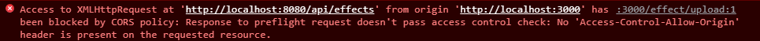

# CORS-Research

## What is CORS?

CORS, short for Cross Origin Resource Sharing, is a mechanism that allows a server to control which webapplication is allowed to request a resource from it, other than itself. The server can be configured using CORS to allow access to a specific origin, if it is a trusted system, like your own frontend application.

An origin consists of: a protocol, a domain and a portnumber. An example of an origin can look something like this: `http://www.totallyrealbank.com/so-much-money/page.html`. In this example the protocol is `http`, the domain is `totallyrealbank.com` and the portnumber, although not specified, is going to be `80`, because our protocol is `http` and `http` implicitly uses `80`. [1^](#sources)

### Same-Origin Policy

Most web servers are configured with a SOP (Same-Origin Policy). This policy rejects a webapplication's request if it's origin (protocol, domain or portnumber) is different than that of the server which it's trying to send a request to. If a webapp from the domain `slightlyworsebank.com` tries to access a resource from our domain (`totallyrealbank.com`), it will be rejected by the SOP, because the domain is different. It has to be the same for the request not to be rejected.

You can see how the SOP can be very restrictive and prevent some applications from communicating when needed. That's why a controlled relaxation, CORS, was introduced. People needed a way to get around the SOP, but still restrict unknown origins from gaining access to the server. [2^](#sources)

### Headers

In order to access a server's resource, one needs to send a request. This is what a request might look like:

```http
GET /resources/data HTTP/1.1
User-Agent: Mozilla/4.0 (compatible; MSIE5.01; Windows NT)
Host: www.slightlyworsebank.com
Accept-Language: en-us
Accept-Encoding: gzip, deflate
Connection: Keep-Alive
Origin: https://totallyrealbank.com
```
In this example `totallyrealbank` is sending a `GET` request to `slightlyworsebank`, which is the server. To figure out where the request is coming from, take a look at the `Origin` header. The server might send a response like this: [3^](#sources)

```http
HTTP/1.1 200 OK
Date: Mon, 01 Oct 2022 00:23:53 GMT
Server: Apache/2
Access-Control-Allow-Origin: https://slightlyworsebank.com
Keep-Alive: timeout=2, max=100
Connection: Keep-Alive
Transfer-Encoding: chunked
Content-Type: application/xml
```

Take a look at the `Access-Control-Allow-Origin` header. This header will tell you which origin was setup using CORS to be allowed to access resources from `slightlyworsebank`. In this case it's only `slightlyworsebank`. Meaning, if the request comes from any other domain other than `slightlyworsebank`, the request will be rejected. Another value for the `Access-Control-Allow-Origin` header can be `*`, which means that requests from all origins will be allowed to go through, which is not what you want, but more on that later.

## Dangers of not having Cors enabled
Cors is one of the most important security features in web applications. If Cors is not enabled this will lead
to major security flaws in the application. This is because your application can be called from any domain. We'll dive deeper into this later.

Normally when CORS is enabled your application is secured to only be called from specific domains. 
This is done by setting the Access-Control-Allow-Origin. When this is not correctly done scam sites can be created that will call your application and steal data from it. 

Your application can't see the diffence between a scam site and a real site if Cors is not enabled. This is why a scam site can use the same endpoints as a legit application would be able to use in this case. 

Let's go through an example of how this can be done:

For this example you have a backend application called "TotatllyRealBank" that has a transfer money endpoint.
This endpoint normally is called by a frontend application that is hosted on the domain "TotallyRealBank.com".
The backend endpoint can be called by the frontend application when CORS is not enabled.
Your frontend application would call the backend application with the following request:

```javascript
fetch('https://TotatllyRealBank.com/transferMoney', {
    method: 'POST',
    body: JSON.stringify({
        amount: 100,
        from: '123456789',
        to: '987654321'
    })
})
```
With this request 100 euro will be transfered from account 123456789 to account 987654321.
But a scam site would be able to do the exact same thing. The only thing that would change is the domain name.
The scam site can even modify all the values in the request. Like the amount of money that is transfered or the account the money will be transfered to.

When CORS is disabled your backend will excecute this request and transfer the money to the scam site.

Luckily CORS exists and can be enabled. This will prevent the scam site from calling your backend application.
When correctly setup your own frontend will be able to call this endpoint as usual, but when the scam site tries to call this endpoint you will see you get the following result:


Sometimes an Api wishes to be called from any domain. This is possible by setting the Access-Control-Allow-Origin to *. 
This allows everything to call you application. Most of the time this is not a good idea. But for certain GET requests this can be useful. For example when you have a public api that returns data about a certain country. This api can be called from any domain. This is because the data that is returned is public and can be used by anyone.

## How to enable CORS in your Api?
How to enable CORS in your Api greatly depends on what framework you are using. In some frameworks enabling and setting up CORS is very easy, in others it is a bit more complicated. In this document I will show you how to enable CORS in the following frameworks:
 - [ASP.NET Core](#aspnet-core)
 - [Spring Boot](#spring-boot)
 - [Node.js/Express](#nodejs)
 - [Laravel](#laravel)

### ASP.NET Core
In ASP.NET Core API enabling CORS is pretty straight forward. First you need to add CORS to the builder.Services in the Program.cs file. You do this by adding the following lines before the builder.Build() line:
```csharp
builder.services.AddCors();
```
After this we need to tell the app to use CORS. This is done by adding the following lines after the builder.Build() line:
```csharp
app.UseCors(x => x
                .WithOrigins("http://localhost:3000")
                .AllowAnyMethod()
                .AllowAnyHeader()
                .AllowCredentials());
```

http://localhost:3000 is in this case the Origin we allow to make requests to this API.

### Spring Boot

Springboot might've one of the easiest ways to enable CORS. All you need to do is add the following annotation to your controller:
```java
@CrossOrigin(origins = "http://localhost:3000")
```

You add this annotation to the controller that contains the methods that you want to allow CORS for. Or you can even add it before the method itself. In this case the Origin we allow to make requests to this API is http://localhost:3000.


### Node.js

To be able to create an API in Node.js with endpoints like you would in asp.net core for example, we need to use Express. Express is a web framework for Node.js. If you're interested in installing Express into your Node.js application, follow this [link](https://expressjs.com/en/starter/installing.html).

To enable CORS in Express, you need to install the CORS npm package. Go ahead and run the following command:

```javascript
npm install --save cors
```

After that you want to setup your application as usual + the CORS you just installed:

```javascript
var express = require('express');
var app = express();
var cors = require('cors');

app.use(cors({
  origin: 'http://localhost:3000'
}));
```

### Laravel

For Laravel enabling CORS is very straightforward. First take a look into your `app/Http/Kernel.php` file and make sure the `HandleCors` middleware is present.

```php
protected $middleware = [
    ...
    \Illuminate\Http\Middleware\HandleCors::class,
    ...
];
```

In your project you'll also find a `config/cors.php` file which is a configuration file generated by Laravel which you can use to setup CORS. This file is simply an associative array with key/value pairs. In it you can specify which methods, origins, headers, etc should be allowed.

```php
<?php

return [

    'paths' => ['api/*', 'sanctum/csrf-cookie'],

    'allowed_methods' => ['*'],

    'allowed_origins' => ['*'],

    'allowed_origins_patterns' => [],

    'allowed_headers' => ['*'],

    'exposed_headers' => [],

    'max_age' => 0,

    'supports_credentials' => false,

];
```

## Sources

-   [1^]() Dahan, M. (2021, November 3). *What are cors attacks and how can you prevent them?* Comparitech. Retrieved November 15, 2022, from https://www.comparitech.com/blog/information-security/cors-attacks-prevent/

-   [2^]() *What is Cors (cross-origin resource sharing)? tutorial &amp; examples: Web security academy.* What is CORS (cross-origin resource sharing)? Tutorial &amp; Examples | Web Security Academy. (n.d.). Retrieved November 15, 2022, from https://portswigger.net/web-security/cors 

-   [3^]() *Cross-origin resource sharing (CORS) - http: MDN.* HTTP | MDN. (n.d.). Retrieved November 15, 2022, from https://developer.mozilla.org/en-US/docs/Web/HTTP/CORS#examples_of_access_control_scenarios 